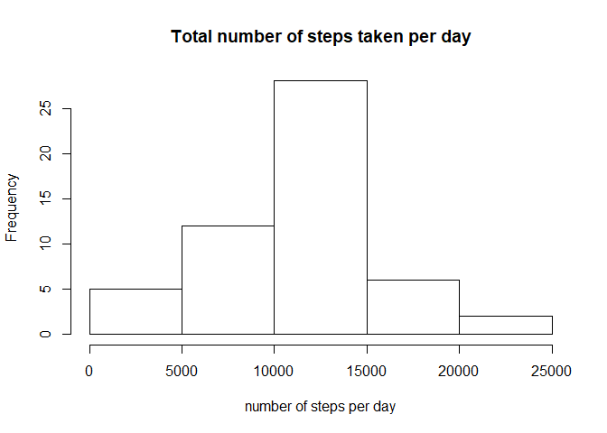
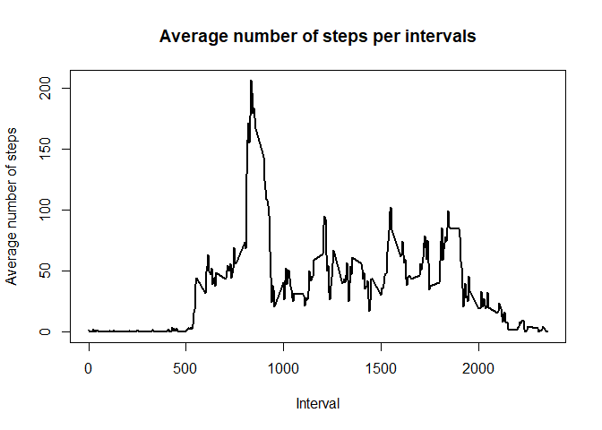
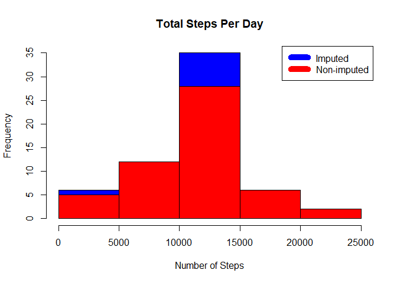

This assignment makes use of data from a personal activity monitoring device. This device collects 
data at 5 minute intervals through out the day. The data consists of two months of data from an anonymous individual collected during the months of October and November, 2012 and include the number
of steps taken in 5 minute intervals each day.  


The purpose of this project was to practice:

* loading and preprocessing data
* imputing missing values
* interpreting data to answer research questions  


## Data
___
The data for this assignment was downloaded from the course web site:

* **Dataset**: [Activity monitoring data](https://d396qusza40orc.cloudfront.net/repdata%2Fdata%2Factivity.zip) [52K]  

The variables included in this dataset are:

* **steps**: Number of steps taking in a 5-minute interval (missing values are coded as NA)

* **date**: The date on which the measurement was taken in YYYY-MM-DD format

* **interval**: Identifier for the 5-minute interval in which measurement was taken

The dataset is stored in a comma-separated-value (CSV) file and there are a total of 17,568 observations in this dataset.

## Loading and preprocessing the data
___
unzip and load data into the `data frame`.

```r
unzip("activity.zip")
activityData <- read.csv(file = "activity.csv", header = T, sep = ",")
```

## What is mean total number of steps taken per day?
___
Sum steps by day, create Histogram, and calculate mean and median.

```r
# removing NA or missing values from activityData
newActivityData <- na.omit(object = activityData)

totalSteps <- with(data = newActivityData, expr = aggregate(steps, by = list(date), FUN = sum))
names(totalSteps) <- c("date", "steps")

hist(totalSteps$steps, main = "Total number of steps taken per day"
           , xlab = "number of steps per day"
           , breaks = seq(0,25000, by=5000))
```

<!-- -->

```r
actSteps.mean <- mean(totalSteps$steps)
actSteps.median <- median(totalSteps$steps) 
```

The `mean` is 1.0766189\times 10^{4} and the `median` is 10765.

## What is the average daily activity pattern?
___

* Calculate average steps for each interval for all days.
* Plot the Average Number Steps per Day by Interval.
* Find interval with most average steps.


```r
averageTotalSteps <- with(data = newActivityData, expr = aggregate(steps, by = list(interval)
                                                                         , FUN = mean))
      names(averageTotalSteps) <- c("interval", "steps.mean")
plot(averageTotalSteps$interval, averageTotalSteps$steps.mean, type = "l"
           , lwd = 2, xlab="Interval", ylab="Average number of steps"
           , main="Average number of steps per intervals")
```

<!-- -->

```r
max_interval <- averageTotalSteps[which.max(averageTotalSteps$steps.mean),1]
```

## Imputing missing values
___

Calculate The total number of missing values:

```r
missingSteps <- sum(is.na(activityData$steps))
```

The total number of missing values: 2304.

Missing data needed to be imputed. Only a simple imputation approach was required for this assignment. Missing values were imputed by inserting the average for each interval.


```r
incomplete <- sum(!complete.cases(activityData))
      imputed_data <- 
            transform(activityData
                      , steps = ifelse(is.na(activityData$steps)
                                       , averageTotalSteps$steps[match(activityData$interval
                                                                       , averageTotalSteps$interval)]
                                       , activityData$steps))
```

NAs are assumed to be zeros to fit the rising trend of the data.


```r
imputed_data[as.character(imputed_data$date) == "2012-10-01", 1] <- 0
```

Recount total steps by day and create Histogram.

```r
totalSteps.imputed <- aggregate(steps ~ date, imputed_data, sum)
hist(totalSteps.imputed$steps, main = paste("Total Steps Per Day"), col="blue"
           , xlab="Number of Steps")
#Create Histogram to show difference. 
hist(totalSteps$steps, main = paste("Total Steps Per Day"), col="red", xlab="Number of Steps"
           , add=T)
      legend("topright", c("Imputed", "Non-imputed"), col=c("blue", "red"), lwd=10)
```

<!-- -->

Calculate new mean and median for imputed data.


```r
actSteps.imputed.mean <- mean(totalSteps.imputed$steps)
actSteps.imputed.median <- median(totalSteps.imputed$steps)
```

Calculate difference between imputed and non-imputed data.

```r
mean_diff <- mean(totalSteps.imputed$steps) - mean(totalSteps$steps)
median_diff <- median(totalSteps.imputed$steps) - median(totalSteps$steps)
```

Calculate total difference.

```r
total_diff <- sum(totalSteps.imputed$steps) - sum(totalSteps$steps)
```

- The imputed data mean is 1.0589694\times 10^{4}
- The imputed data median is 1.0766189\times 10^{4}
- The difference between the non-imputed mean and imputed mean is -176.4948964
- The difference between the non-imputed mean and imputed mean is 1.1886792
- The difference between total number of steps between imputed and non-imputed data is 7.5363321\times 10^{4}. Thus, there were r total_diff more steps in the imputed data.  

## Are there differences in activity patterns between weekdays and weekends?
___

Create a new factor variable in the dataset with two levels - "weekday" and "weekend", and compare the two. There is a higher peak earlier on weekdays, and more overall activity on weekends.


```r
weekdays <- c("Monday", "Tuesday", "Wednesday", "Thursday", "Friday")

imputed_data$dow = as.factor(ifelse(is.element(weekdays(as.Date(imputed_data$date)),weekdays)
                                          , "Weekday", "Weekend"))
      
totalSteps.imputed <- aggregate(steps ~ interval + dow, imputed_data, mean)
      
library(lattice)
      
xyplot(totalSteps.imputed$steps ~ totalSteps.imputed$interval|totalSteps.imputed$dow
             , main="Average Steps per Day by Interval",xlab="Interval", ylab="Steps",layout=c(1,2)
             , type="l")
```

<!-- -->
